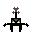

# RayCasting Engine

A high-performance, pixel-perfect 2D/3D Raycasting engine built with TypeScript and HTML5 Canvas. Inspired by classic 90s shooters like *Doom* and *Wolfenstein 3D*, this project implements a custom software renderer from scratch.



## 🚀 Features

### Core Engine
- **DDA Algorithm**: Implements the Digital Differential Analyzer (DDA) for efficient and perfect ray-wall collision detection.
- **Fish-eye Correction**: Perpendicular distance calculation ensuring walls appear straight and realistic across the entire Field of View (FOV).
- **Prototypical 3D Projection**: Dynamic scaling of wall height based on distance, with vertical centering and shading for depth perception.

### Performance & Visuals
- **Zero-Gap Rendering**: Optimized 3D slice rendering that eliminates sub-pixel gaps (black lines) between wall segments.
- **Pixel-Perfect Sprites**: "Doom-style" billboarded sprites that always face the player.
- **Z-Buffer Occlusion**: Full Z-buffer implementation for sprites, allowing objects to be correctly hidden behind walls.
- **Crisp Pixel Art**: Custom internal scaling and CSS rendering rules (`image-rendering: pixelated`) to preserve the sharpness of low-res textures.

### Gameplay & Controls
- **Smooth Movement**: State-based keyboard handling for fluid WASD navigation without OS-level repeat delays.
- **Mouse-Aiming**: Instantaneous camera rotation and FOV tracking synced to the mouse position.
- **Mini-Map**: Real-time 2D visualization of the map, rays, and player orientation.

## 🛠️ Technology Stack
- **Language**: [TypeScript](https://www.typescriptlang.org/)
- **Graphics**: [HTML5 Canvas API](https://developer.mozilla.org/en-US/docs/Web/API/Canvas_API)
- **Build Tool**: [Vite](https://vitejs.dev/)
- **Styling**: Vanilla CSS

## 📁 Project Structure

```bash
raycasting-video/
├── src/
│   ├── main.ts             # Entry point, animation loop, input handling
│   ├── style.css           # Global styles and pixel-art rendering rules
│   └── world/
│       ├── 2dGrid.ts       # Mini-map and 2D world visualization
│       ├── 3dRender.ts     # Wall projection and ceiling/floor rendering
│       ├── enemy.ts        # Sprite class, billboarding, and Z-buffer logic
│       ├── map.ts          # Static 2D map data
│       ├── player.ts       # Player physics, FOV, and mouse logic
│       └── ray.ts          # DDA raycasting implementation
└── public/
    └── enemy.png           # 32x32 pixel art texture
```

## 🎮 Getting Started

### Prerequisites
- [Node.js](https://nodejs.org/) (v16+)
- [npm](https://www.npmjs.com/)

### Installation
1. Clone the repository:
   ```bash
   git clone https://github.com/your-username/raycasting-engine.git
   ```
2. Navigate to the project directory:
   ```bash
   cd raycasting-video
   ```
3. Install dependencies:
   ```bash
   npm install
   ```
4. Start the development server:
   ```bash
   npm run dev
   ```

## ⌨️ Controls
- **W / A / S / D**: Move Forward / Left / Backward / Right
- **Mouse**: Rotate Camera / Aim

## 📜 License
MIT License - feel free to use this engine for your own retro-style projects!
